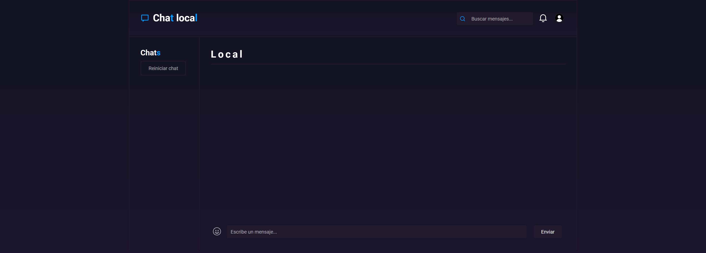
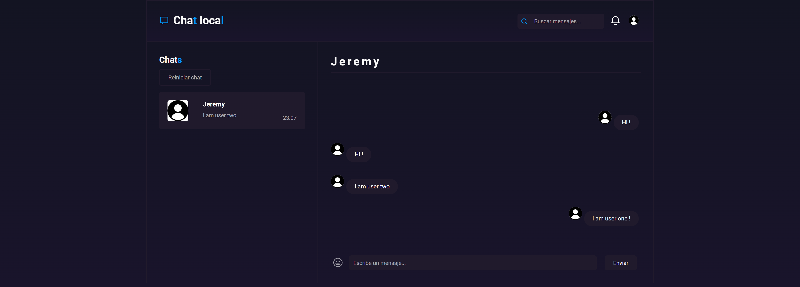
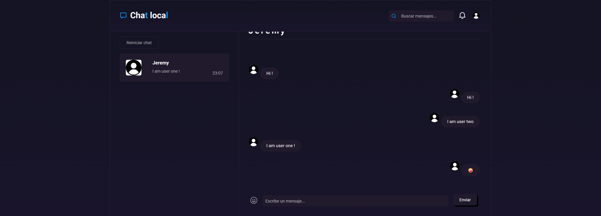

# Chat Local

Aplicación de mensajería de una manera local realizada con Service Workers.

👉 Enlace: [https://chatlocal.netlify.app/](https://chatlocal.netlify.app/)  

  
  
  
  
  
  
  

## Login

Antes de entrar a la web, solo necesito un nombre y si quieres puedes seleccionar tu propia imagen

## Chat en uso

Para poder hablar de manera local, debes abrir dos ventanas webs y logearte en cada una
Se cargará automáticamente el mensaje utilizando **Service Workers** 

### Usuario uno en el chat local

### Usuario dos en el chat local

